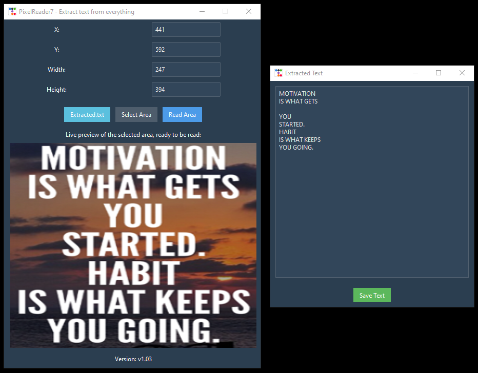

# 📸 PixelReader7 - Extract Text from Everything

The app that lets you extract text from anything on your screen. Need to capture that juicy quote from a video, meme or an annoying popup? Here you go.

## 🔥 Features
- **Dark Theme**: Because why not.
- **Real-Time Preview**: See what you’re about to capture.
- **Super Fast**: 50ms refresh rate. Useless but smoother.
- **Select Area**: Easy area selection.

## 🚀 How to Use
1. **Run the App**: Execute Run.bat or `python main.py`.
2. **Set Dimensions**: Enter the X, Y, Width, and Height of the area you want to capture or use the area selector _(less pain)_.
3. **Select Area**: Click 'Select Area' to visually choose your region. 
4. **Read Area**: Click 'Read Area' to extract text from the area.
5. **Save Text**: A new window will pop up with your extracted text. Copy from it or click 'Save Text' insta save in root folder.

## 🛠 Requirements
- [Tesseract](https://github.com/UB-Mannheim/tesseract/wiki) _(Mandatory for running on Windows. There are many other libraries for GNU/Linux distros)_
- Python 3.x
- `ttkbootstrap`
- `pytesseract`
- `Pillow`

Install the dependencies:
```sh
pip install ttkbootstrap pytesseract pillow
```

## ⚡ Quick Start
- Run.bat or
```sh
python main.py
```

## 📸 Screenshots


## 💡 Tips
- **Select Carefully**: Make sure you’ve got the right area selected, or you might end up with your desktop wallpaper text.
- **Save Your Work**: Don’t forget to click 'Save Text' unless you love repeating yourself.

## 🤖 Behind the Scenes
PixelReader7 uses **Tesseract OCR** to work its magic. Make sure you have `tesseract.exe` in the right spot, or the app will ask where you've installed that thing.

## 🎉 Thanks for visiting and Enjoy!
